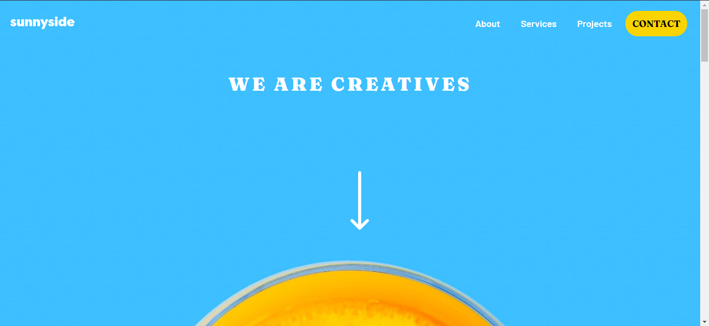

#About

This is my attempt at [Sunnyside Agency Landing Page Challenge on Frontend Mentors](https://www.frontendmentor.io/challenges/sunnyside-agency-landing-page-7yVs3B6ef). Frontend Mentors help you hone your front-end skills and is a great asset for all aspiring web developers.

##Table of Contents

- [Overview](#overview)
  - [The challenge](#the-challenge)
  - [Screenshot](#screenshot)
  - [Links](#links)
- [My process](#my-process)
  - [Built with](#built-with)
  - [What I learned](#what-i-learned)
- [Author](#author)
- [Acknowledgments](#acknowledgments)

## Overview

### The challenge

Users should be able to:

- View the optimal layout for the site depending on their device's screen size
- See hover states for all interactive elements on the page

### Screenshot

### Links

- [Solution URL](https://github.com/OdeStaples/Sunnyside)
- [Live Site URL](https://odestaples.github.io/Sunnyside/)

## My process

### Built with

- Semantic HTML5 markup
- SCSS
- Flexbox
- CSS Grid

### What I learned

During the course of completing this project, I was able to sharpen my Frontend Development skills which includes HTML5, CSS3, JavaScript and Responsive web design.

## Author

- GitHub - [OdeStaples](https://github.com/OdeStaples)
- Frontend Mentor - [Ode Staples](https://www.frontendmentor.io/profile/OdeStaples)

Like always, my gratitute goes to my amazing guys at [Frontend Mentor](https://www.frontendmentor.io) who are working effortlessly to put this challenges together to help Frontend Developers get practical knowledge while building out these projects.

